```{r setup, include=FALSE}
knitr::opts_chunk$set(echo = TRUE)
options(scipen = 3)
library(knitr)
library(glmmTMB)
library(INLA)
library("sp")
```

\vspace{-5truemm}

# Donald Duck
## Introduction
Every government takes great responsibilities for the development of their nations, and presidential elections always raise extensive attention of international society. Given the vote count results from the 2016 United States presidential election, this report embeds Bayesian inference in some spatial analysis. Specifically, we used a Besag York Mollié (BYM) model to investigate the most important demographic factors that influenced the voters in Wisconsin to support the elected president Trump. The potential factors in Trumpism include but not limited to urbanity/rurality, ethnicity and geographical variation. 

```{r message=FALSE, warning=FALSE, echo=FALSE, results='hide'}
load("./data/Wisconsin.RData")

# resTrump=diseasemapping::bym(trump~logPdens+propWhite+propInd,
#                              data=wisconsinCsubm,
#                              prior =list(
#                                sd =c(log(2.5),0.5),propSpatial =c(0.5,0.5)),
#                              Ntrials =wisconsinCsubm$Total,
#                              family ="binomial")
# save(resTrump,file ="./data/resWisconsin.RData",compress ="xz")

(load("./data/resWisconsin.RData"))
```

## Method
We assume that the response $\texttt{Trump}$, say Y, follows the Binomial distribution, since the number of votes is positive discrete, and individual voter made a binary decision to either support Trump or other parties (mostly Democratic). A generalized mixed effect model with logit link is proposed to interpret the data.

$$             
\begin{aligned}
Y_{i} & \sim \operatorname{Binomial}\left (N_i, p_i\right) \\
\operatorname{logit} \left(p_{i}\right) &= \mu + X_{i} \beta + U_{i} \\
U_{i} & \sim \text{BYM}(\sigma, \phi) \\
\end{aligned}
$$

where $N_i$ denotes the total number of votes in county i, and $p_{i}$ indicates the corresponding probability of voting Trump. $\mu$ is the fixed intercept and $X_{i}\beta$ indicates the fixed effects associated with covariates, such as rurality ($\texttt{logPdens}$) and ethnicity ($\texttt{propWhi}$ and $\texttt{propInd}$), while $U_i$ is the spatial random effect following a BYM model. 

Moreover, $\sigma$ is a standard deviation parameter, by which we think $\sigma \approx sd(U_{i})$. $\phi$ is a spatial dependence parameter, and it is considered independent variation with neighbors when approaching zero. To better interpret the spatial randomness, we break down the model in parts and reparametrize it below. $W_i$ is a spatial Conditionally Autoregressive Model (CAR), which involves a Markov random field whose parameters depend on bordering regions denoted by $\sim i$. Particularly, $\xi^2 \approx Var(W_{i})$ for some c. $V_i$ is an i.i.d random variable in the Normal distribution, representing independent random effect of variance $\tau^2$ from different counties. 

$$             
\begin{aligned}
U_{i} &= W_{i} + V_{i} \\
V_{i} &\sim \text{i.i.d N}(0,\tau^2)\\
W_{i}|W_{-i} &\sim \text{N}(\operatorname{mean} \{W_j;j \sim i\}, c\xi^2 / |\sim i|)\\
\sigma &= \sqrt{\xi^2 + \tau^2} \\
\phi &= \frac{\xi}{\sqrt{\xi^2 + \tau^2}} = \frac{\xi}{\sigma}\\
\end{aligned}
$$

Since ${\sigma}$ stands for overall standard deviation, and in this way, $\phi$ explains the spatial proportion of Trumpism. Bayesian inference allows us to integrate prior knowledge with the hyperparameters. It is typically believed that the prior distributions have a prior median of log(2.5) for ${\sigma}$ and 0.5 for $\phi$. Therefore, we fixed all the aforementioned hyperparameters using penalized complexity priors for precision in R-INLA, as follow:

$$
\begin{aligned}
P({\sigma} &> \log(2.5)) = 0.5 \\
P(\phi &> 0.5) = 0.5 \\
\end{aligned}
$$

## Results
Inspecting the fitted and actual values in Figure 1, the proposed model presents high-level capacity of modelling the popularity of Trump being elected in 2016. Apparently, we could confirm that big cities like Madison and Milwaukee were not in favor of the Republican, while majority of suburb and countryside areas were highly supportive. Ethnically, Trump got a low support percentage among Native Americans who live in the northern region. However, Caucasian Americans live across the state and created a fairly red map, which led to the Republican victory in Wisconsin. Although the model holds high interpretability toward the data and provides smoothing for $U$, the residuals are scattered all over the map. These values are taken into account by random effect, as demonstrated in Figure 1(d). There exists spatial variation where our model seems to underestimate the odds of voting Trump in the central and southeastern areas; however, huge overestimation is found for cities closed to the northern and southwestern borders.

```{r message=FALSE, warning=FALSE, echo=FALSE, fig.align="center", fig.width=5, fig.asp=1, fig.cap="Exploratory data analysis (top) and model results (bottom) for Wiscosin vote counts", fig.subcap=c("Population density", "Indingenous proportion", "White proportion", "Random effect", "Fitted value", "Actual data"), fig.ncol=3, fig.nrow=2, out.width=".3\\linewidth",}

include_graphics('./figure/maps-2.png')
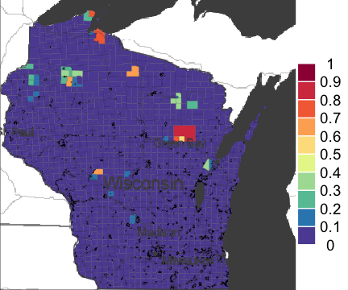
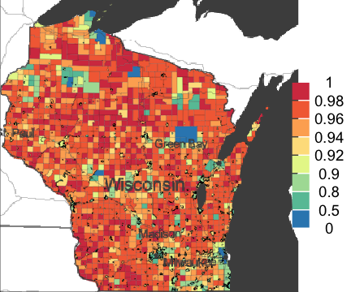
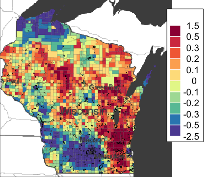
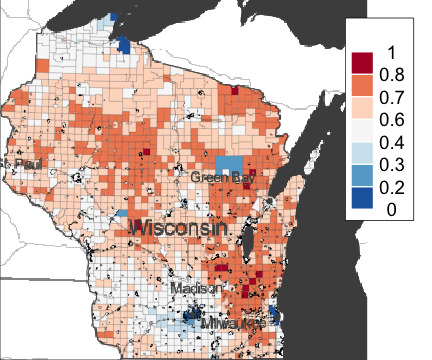
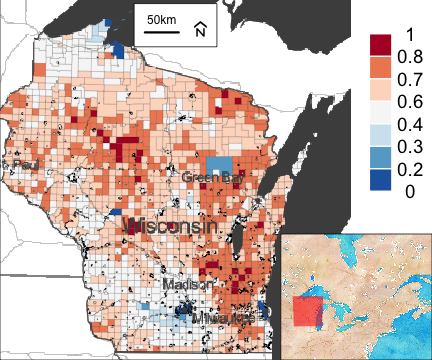
```

The main results of our modelling are shown in Table 1, revealing the odds ratio based on a single unit increase in demographic factors of interest, along with the used spatial parameters. Note that $\texttt{propSpatial}$ is merely the spatial proportion of random effect.

Imagining a deserted land without any Whites and Natives living, the average odds ratio of supporting Trump is merely 0.570. Modelling shows more votes for Trump if there are more Caucasian Americans within a region, whereas Native Americans are more likely to support Clinton. Comparing an area only resided by Whites to one that has no Whites living, their odds ratios of Trumpism is different by a factor of 4.132. Likewise, the odds ratio is multiplicatively decreased by 0.454 if we go from an Indian reserve to an arbitrary municipality. To further evaluate the rural influence on the election, we transformed covariate $\texttt{logPdens}$ back to a natural scale for interpretation. From a more sensible perspective, we conclude that the odds of supporting Trump would decrease by a factor of 0.945 ($0.922^{\log2}$) if population density doubles in a county.

The posterior median of spatial proportion is far away from 0, which indicates significant dependency between neighbors. Also, the overall standard deviation is expected to be above 1 in terms of odds ratio. That being said, it is not surprising to see if the odds of endorsing the Republican party fluctuates by a factor of 1.375 from region to region. 

```{r message=FALSE, warning=FALSE, echo=FALSE, fig.align="center", fig.width=5, fig.asp=1, fig.cap="Exploratory data analysis and model diagnostics for Wiscosin vote counts", fig.subcap=c("Pop dens", "Ind", "white", "random", "fitted", "actual"), fig.ncol=3, fig.nrow=2, out.width=".3\\linewidth",}

table1 <- (resTrump$parameters$summary[,paste0(c(0.5,0.025,0.975),"quant")])
table1[-6,] <- exp(table1[-6, ])
table1 <- rbind(round(table1, 3))
knitr::kable(table1,
             digits =5,
             booktabs = TRUE,
             caption = "Fixed effects, random effects in odds ratio, and spatial proportion")
```

## Conclusion 
In a nutshell, we investigated the factors of interest in the 2016 Republican victory in Wisconsin. Our result demonstrate significant impact of population density and race. For urban areas, we assume higher population density, and that actually reduced the support rate for Trump, vice versa. In some regions with higher proportion of Caucasian American voters, we expect such a ethical structure brought more support for Trump; that of Native Americans would rather vote for the Democratic party in contrast. Spatial variation is evident across the state. 

\newpage
## Appendix
```{r, fig.show='hide', message=FALSE, warning = FALSE,results='hide'}
load("./data/Wisconsin.RData")

# resTrump=diseasemapping::bym(trump~logPdens+propWhite+propInd,
#                              data=wisconsinCsubm,
#                              prior =list(
#                                sd =c(log(2.5),0.5),propSpatial =c(0.5,0.5)),
#                              Ntrials =wisconsinCsubm$Total,
#                              family ="binomial")
# save(resTrump,file ="./data/resWisconsin.RData",compress ="xz")

(load("./data/resWisconsin.RData"))

# theColTrump=mapmisc::colourScale(
#   wisconsinCsubm$propTrump,
#   col="RdBu",
#   breaks=sort(unique(setdiff(c(0,1,seq(0.2,0.8,by =0.1)),0.5))),
#   style ="fixed",
#   rev =TRUE)
# 
# theColPop=mapmisc::colourScale(wisconsinCsubm$pdens,
#                                col="Spectral",breaks=11,
#                                style ="equal",transform ="log",
#                                digits =1,rev =TRUE)
# 
# theColWhite=mapmisc::colourScale(wisconsinCsubm$propWhite,
#                                  col ="Spectral",
#                                  breaks =c(0,0.5,0.8,0.9,seq(0.9,1,by =0.02)),
#                                  style ="fixed",rev =TRUE)
# 
# theColInd=mapmisc::colourScale(
#   wisconsinCsubm$propInd,
#   col="Spectral",
#   breaks=seq(0,1,by =0.1),
#   style ="fixed",
#   rev =TRUE)
# 
# theBg=mapmisc::tonerToTrans(
#   mapmisc::openmap(wisconsinCm,fact=2,path="stamen-toner"),col ="grey30")
# theInset=mapmisc::openmap(
#   wisconsinCm,zoom=6,path="stamen-watercolor",
#   crs=mapmisc::crsMerc,buffer=c(0,1500,100,700)*1000)
# 
# # Pop dens
# mapmisc::map.new(wisconsinCsubm,0.85)
# plot(wisconsinCsubm,col=theColPop$plot,add=TRUE,lwd =0.2)
# plot(theBg,add =TRUE,maxpixels =10^7)
# mapmisc::legendBreaks("right", theColPop,bty ="n",inset =0)
# 
# # Ind
# mapmisc::map.new(wisconsinCsubm,0.85)
# plot(wisconsinCsubm,col=theColInd$plot,add=TRUE,lwd =0.2)
# plot(theBg,add =TRUE,maxpixels =10^7)
# mapmisc::legendBreaks("right", theColInd,bty ="n",inset =0)
# 
# # white
# mapmisc::map.new(wisconsinCsubm,0.85)
# plot(wisconsinCsubm,col =theColWhite$plot,add =TRUE,lwd =0.2)
# plot(theBg,add =TRUE,maxpixels =10^7)
# mapmisc::legendBreaks("right", theColWhite,bty ="n",inset=0)
# theColRandom=mapmisc::colourScale(
#   resTrump$data$random.mean,
#   col="Spectral",
#   breaks =11,
#   style ="quantile",
#   rev =TRUE,dec=1)
# theColFit=mapmisc::colourScale(
#   resTrump$data$fitted.invlogit,
#   col="RdBu",
#   rev =TRUE,
#   breaks=sort(unique(setdiff(c(0,1,seq(0.2,0.8,by =0.1)),0.5))),
#   style="fixed")
# 
# # Random 
# mapmisc::map.new(wisconsinCsubm,0.85)
# plot(resTrump$data,col=theColRandom$plot,add =TRUE,lwd =0.2)
# plot(theBg,add =TRUE,maxpixels =10^7)
# mapmisc::legendBreaks("topright", theColRandom)
# 
# # Fitted
# mapmisc::map.new(wisconsinCsubm,0.85)
# plot(resTrump$data,col=theColFit$plot,add =TRUE,lwd =0.2)
# plot(theBg,add =TRUE,maxpixels=10^7)
# mapmisc::legendBreaks("topright", theColFit)
# 
# # Trump
# mapmisc::map.new(wisconsinCsubm,0.85)
# sp::plot(wisconsinCsubm,col=theColTrump$plot,add =TRUE,lwd =0.2)
# raster::plot(theBg,add =TRUE,maxpixels =10^7)
# mapmisc::insetMap(wisconsinCsubm,"bottomright",theInset,outer=TRUE,width =0.35)
# mapmisc::scaleBar(wisconsinCsubm,"top",cex =0.8)
# mapmisc::legendBreaks("topright", theColTrump,bty ="n",inset=0)

include_graphics('./figure/maps-2.png')


table1 <- (resTrump$parameters$summary[,paste0(c(0.5,0.025,0.975),"quant")])
table1[-6,] <- exp(table1[-6, ])
table1 <- rbind(round(table1, 3))
knitr::kable(table1,
             digits =5,
             booktabs = TRUE,
             caption = "Fixed effects, random effects in odds ratio, 
             and spatial proportion")
```

\newpage
# Spatial Analysis on COVID-19 in England
## Introduction
The COVID-19 epidemic does not only impose heavy economic burden globally, but it has also caused a large number of deaths. This report focus on the number of cases affected by COVID-19 and its relation to air pollution, unemployment rate and ethnicity. In particular, we applied an extensive spatial analysis on top of Bayesian statistics, and modeled the COVID-19 cases within England with a Besag York Mollié (BYM) model. 

```{r , echo=FALSE, message=FALSE, warning = FALSE, results='hide'}
rm(list = ls())

(load("./data/England_shp.RData"))
UK_shp$logExpected=log(UK_shp$E)

# # remove an island
UK2=UK_shp[grep("Wight", UK_shp$Name,invert=TRUE),]

# englandRes=diseasemapping::bym(cases~offset(logExpected)+Ethnicity+modelledpm25+Unemployment,
#                                prior=list(sd=c(0.5,0.5),propSpatial =c(0.5,0.5)),
#                                family ="poisson",data =UK2)
# save(englandRes,file ="./data/englandRes.RData")

load("./data/englandRes.RData")
```

## Method
We believe the Poisson distribution would help us to understand the number of patients with coronavirus disease, say Y. The number of cases is positively discrete, and we tend to investigate the incidence rate of COVID-19 among England population. Thus, we propose a generalized mixed effect model with log link to interpret the data in each areal unit.

$$
\begin{aligned}
Y_{i} & \sim \operatorname{Poisson}\left (E_i \lambda_i\right) \\
\operatorname{log} \left(\lambda_i\right) &= \mu + X_{i} \beta + U_{i} \\
U_{i} & \sim \text{BYM}(\sigma, \phi) \\
\end{aligned}
$$

where $E_i$ denotes the observed counts under baseline incidence rates, and accordingly, $\lambda_i$ indicates the relative risk for coronavirus disease in area i. $X_{i}$ is a vector of ambient air pollution, and percentages of unemployment and visible minorities in the health authority, and $\beta$ presents their corresponding fixed effect; $\mu$ is the fixed intercept in the linear relation. 

As for $U_i$ in the BYM model, it comprises random effects from a spatially independent process $V_i$, and a spatially process $W_i$ yet conditionally dependent with neighbors. Mathematically, $\sigma$ is approximately the overall standard deviation parameter, and $\phi$ solely specifies spatial dependence between neighbors. These parameters are reparametrized into below equations, in which $\xi^2$ resembles spatially structured variance with some scalar c, and $\tau$ implies the independent variability in regional variation.

Meanwhile, we set the priors for $\sigma$ and $\phi$ using penalized complexity priors for precision in R-INLA software. Explicitly, we consider both of them with prior medians of 0.5.

$$
\begin{aligned}
U_{i} &= W_{i} + V_{i} \\
V_{i} &\sim \text{i.i.d N}(0,\tau^2)\\
W_{i}|W_{-i} &\sim \text{N}(\operatorname{mean} \{W_j;j \sim i\}, c\xi^2 / |\sim i|)\\
\sigma &= \sqrt{\xi^2 + \tau^2} \\
\phi &= \frac{\xi}{\sqrt{\xi^2 + \tau^2}} = \frac{\xi}{\sigma}\\
\\
P(\sigma &> 0.5) = 0.5 \\
P(\phi&> 0.5) = 0.5 \\
\end{aligned}
$$


To summarize contribution of this report, we show insight to answer the following research hypotheses:
\begin{itemize}
  \item  Air pollution puts stress on human respiratory system, so more people are affected by COVID-19 with terrible air pollution.
  \item High unemployment leads to more infection, due to great deprivation and low access to health care.
  \item In addition, ethnic minorities are more likely to be affected by COVID-19, because of living in multi-generational households, relatively risky occupations, and structural racism upon hospitalization. 
\end{itemize}

## Results
According to exploratory findings in Figure 2(a-e), we observe widespread patterns of coronavirus disease in counties that enclose Greater London, as well as some northern health authorities. Air pollution is severe in the south of Great Britain, so as the percentage of ethical minorities is high. Additionally, unemployment is rather low in the South, but high in the North and East. These predictor distributions seem natural, due to the effect of urbanization. Highlighted by the expected counts in Figure 2(e), we see the general medical condition for pre-covid, with known incidence rates.

Speaking of the proposed model, interpretability is very high in fact, although readers may feel the following maps are rough in first impression. The disparity may be caused by color choice and more importantly, the fact that $E$ serves as an offset term in our Poisson modelling. Given the relative rate of infection per person $\lambda_i$ and expected counts $E_i$, we generated Figure 2(h) to outline the predicted number of cases. The result is very consistent with confirmed cases in Figure 2(a). Random effect in log scale is fairly smooth over the map as well.

```{r message=FALSE, warning=FALSE, echo=FALSE, fig.align="center", fig.width=5, fig.asp=1, fig.cap="Exploratory data analysis (a-e) and model results (f-h) for COVID-19 data in England", fig.subcap=c("Number of cases", "PM2.5 concentrations", "Minorities percentage", "Unemployment rate", "Expected counts", 'Random effect', "Lambda", "Predicted cases"), fig.ncol=4, fig.nrow=2, out.width=".25\\linewidth",}
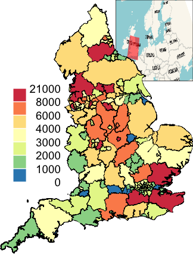 # Cases 
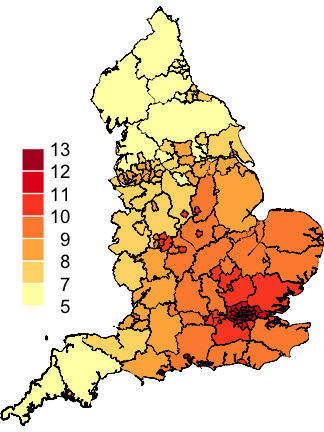 # pm
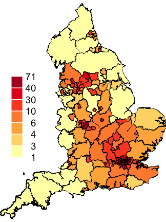 # eth
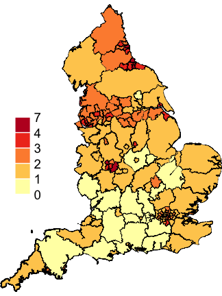 # unemp

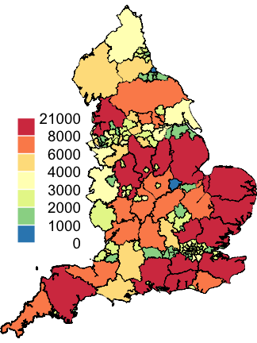 # E
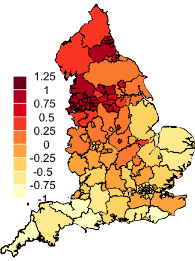 # random
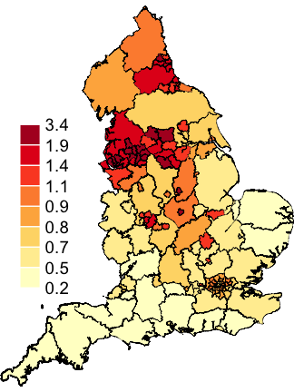 # lambda 
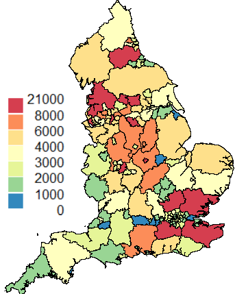 # predict 

```

The main results of our modelling are shown in Table 2, revealing the relative risk based on a single unit increase in selected environmental and social-cultural factors along the spatial parameters. It is worth noting that $\texttt{propSpatial}$ considers the spatial proportion of random effect.

Suppose you live in an area without unemployment, minorities and air pollution, the average COVID-19 risk is 0.365 during the pandemic. Another words, if you feel ill at this time, there is around 36.5% chance that you are affected by coronavirus. 

All covariates of interest exert positive effects on COVID-19 infection risk, despite weak evidence for concentrations of fine particulate matter (PM 2.5). Within a health authority, 1 percentage higher in unemployment rate is expected to increase multiplicatively the relative risk of covid by 1.12. As PM 2.5 level goes up by 1 unit and the other variables are fixed, the relative risk increases by a factor of 1.057, which seems subtle. Moreover, we adjust the unit scale towards ethnicity for better interpretation. Holding other variables constant, the relative risk would rise up by a factor of 1.127 ($1.02^{10}$) when the percentage of visible minorities goes up by 10%. 

The posterior median of spatial proportion is around 90%, which indicates the primary residual variation from conditional dependency between neighboring counties. The expected overall standard deviation is fairly larger than 1, which suggests significant discrepancy of relative risk on COVID-19 from region to region.  

```{r message=FALSE, warning=FALSE, echo=FALSE, fig.align="center", fig.width=5, fig.asp=1, fig.cap="Exploratory data analysis (a-e) and model results (f-h) for COVID-19 data in England", fig.subcap=c("Number of cases", "PM2.5 concentrations", "Minorities percentage", "Unemployment rate", "Expected counts", 'Random effect', "Lambda", "Predicted cases"), fig.ncol=4, fig.nrow=2, out.width=".25\\linewidth",}


table2 <- englandRes$parameters$summary[,c(4,3,5)]
table2[-6,] <- exp(table2[-6, ])
table2 <- rbind(round(table2, 3))

knitr::kable(table2,
             digits =5,
             booktabs = TRUE,
             caption = "Fixed effects, random effects in relative risk, and spatial proportion")
```

## Conclusion
In short, this report contributes to high-level visualization of the effect of COVID-19 over different regions of England. Using Bayesian inference on top of a semi-parametric model, we examine the number of confirmed over several factors, which are air pollution concentration, unemployment rate and minority proportion. Based on our modelling, we believe exposure to ambient air pollution makes people more susceptible to COVID-19; however, the relevant evidence is slightly weak. We will keep collecting data, and investigate the effect in our future research. Second, it is concluded that severe unemployment and minority percentage have a positive relationships with covid infection, which might be mainly caused by barriers from health care and great exposure to coronavirus. Meanwhile, geographical variation exists and seems very smooth in our result.

\newpage
## Appendix
```{r, fig.show='hide', message=FALSE, warning = FALSE, results='hide'}
rm(list = ls())

(load("./data/England_shp.RData"))
UK_shp$logExpected=log(UK_shp$E)

# # remove an island
UK2=UK_shp[grep("Wight", UK_shp$Name,invert=TRUE),]

englandRes=diseasemapping::bym(
  cases~offset(logExpected)+Ethnicity+modelledpm25+Unemployment,
                               prior=list(sd=c(0.5,0.5),propSpatial =c(0.5,0.5)),
                               family ="poisson",data =UK2)
save(englandRes,file ="./data/englandRes.RData")

load("./data/englandRes.RData")

# casesCol=mapmisc::colourScale(UK2$cases,dec =-3,breaks =12,
#                               col ="Spectral",style="quantile",rev=TRUE)
# Ecol=mapmisc::colourScale(UK2$E,breaks =casesCol$breaks,
#                           col =casesCol$col,style="fixed")
# pmCol=mapmisc::colourScale(UK2$modelledpm25,breaks =9,dec =0,style ="quantile")
# ethCol=mapmisc::colourScale(UK2$Ethnicity,breaks =9,digits =1,style ="quantile")
# uCol=mapmisc::colourScale(UK2$Unemployment,breaks =12,dec =0,style ="quantile")
# rCol=mapmisc::colourScale(englandRes$data$random.mean,breaks =12,
#                           dec =-log10(0.25),style ="quantile")
# fCol=mapmisc::colourScale(englandRes$data$fitted.exp,
#                           breaks =9,dec =1,style ="quantile")
# insetEngland1=mapmisc::openmap(UK2,zoom =3,fact =4,
#                                path ="waze",crs =CRS("+init=epsg:3035"))
# pCol=mapmisc::colourScale(UK2$E*englandRes$data$fitted.exp,breaks=casesCol
#                           $breaks,col=casesCol$col,style="fixed")
# 
# # library("raster")
# insetEngland=raster::crop(insetEngland1,
#                           extend(extent(insetEngland1),-c(25,7,4,9.5)*100*1000))
#
# mapmisc::map.new(UK2)
# mapmisc::insetMap(UK_shp,"topright", insetEngland,width =0.4)
# plot(UK2,col =casesCol$plot,add =TRUE,lwd =0.2)
# mapmisc::legendBreaks("left", casesCol,bty ="n")
# mapmisc::map.new(UK2)
# plot(UK2,col =Ecol$plot,add =TRUE,lwd =0.2)
# mapmisc::legendBreaks("left", casesCol,bty ="n")
# mapmisc::map.new(UK2)
# plot(UK2,col =pmCol$plot,add =TRUE,lwd =0.2)
# mapmisc::legendBreaks("left", pmCol,bty ="n")
# mapmisc::map.new(UK2)
# plot(UK2,col =ethCol$plot,add =TRUE,lwd =0.2)
# mapmisc::legendBreaks("left", ethCol,bty ="n")
# mapmisc::map.new(UK2)
# plot(UK2,col =uCol$plot,add =TRUE,lwd =0.2)
# mapmisc::legendBreaks("left", uCol,bty ="n")
# mapmisc::map.new(UK2)
# plot(UK2,col =rCol$plot,add =TRUE,lwd =0.2)
# mapmisc::legendBreaks("left", rCol,bty ="n")
# mapmisc::map.new(UK2)
# plot(UK2,col =fCol$plot,add =TRUE,lwd =0.2)
# mapmisc::legendBreaks("left", fCol,bty ="n")
#
# mapmisc::map.new(UK2)
# plot(UK2,col=pCol$plot,add =TRUE,lwd =0.2)
# mapmisc::legendBreaks("left", pCol,bty ="n")

 # Cases 
 # pm
 # eth
 # unemp

 # E
 # random
 # lambda 
 # predict 

table2 <- englandRes$parameters$summary[,c(4,3,5)]
table2[-6,] <- exp(table2[-6, ])
table2 <- rbind(round(table2, 3))

knitr::kable(table2,
             digits =5,
             booktabs = TRUE,
             caption = "Fixed effects, random effects in relative risk,
             and spatial proportion")
```


